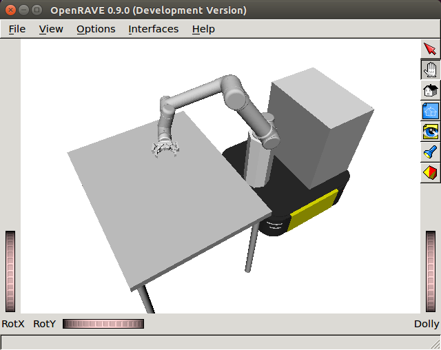

# UR5 Controller Singularity

<p align="center">
     <br/>
    Figure 1: UR5 Robot with Ridgeback and RobotiQ end-effettor in OpenRAVE within a Singularity container with Ubuntu 14.04 and ROS Indigo.
</p>

## Developers and Contributors
UR5Controller Singulairyt was developed by the Robotics Lab in the School of Computing at the University of Leeds. 
- Author: [Rafael Papallas](http://rpapallas.com), [Wissam Bejjani](https://github.com/WissBe).
- Current maintainor: [Rafael Papallas](http://rpapallas.com), [Wissam Bejjani](https://github.com/WissBe).

## License
UR5Controller Singularity is licensed under GNU General Public License v3.0. 
The full license is available [here](https://github.com/roboticsleeds/ur5controller_singularity/blob/master/LICENSE). 

## Instructions

This is a Singularity container for [`ur5controller`](https://github.com/roboticsleeds/ur5controller)
package.

Clone and build the singularity:

```
git clone https://github.com/roboticsleeds/ur5controller_singularity
cd ur5controller_singularity
./build.sh
```

This should create a local Ubuntu 14.04 file system with ROS Indigo, `or\_urdf`,
and `ur5controller` in it. 

It will take a while to build (approximately 40 minutes). Once built, you will
automatically enter into the singualrity environment (which will build your catkin
workspace).

When you need to enter your singularity environment, simply run `./run.sh`.

This should put you into a singularity environment. To test if everything was
succesful you can run:
```
cd ~/ur5_demo
python ur5_demo.py
```

And you should see an OpenRAVE window with UR5 being loaded.

## Notes
- Note that we have pre-generated the robot inverse kinematics for OpenRAVE and
placed them under your singularity home directory just to save time as this 
takes a while. This is just the kinematics for our specific configuration, if you
change the model then OpenRAVE will generate new IK solutions for your new model.
- During build time we create some temporary files (`scripts` and `build`) that we
are using to build everything. Once finished we erase those files.
- The `home` directory located under this repository contains the following important
data: `.openrave` with the prepoulated IK solutions to UR5 robot, `.bashrc` containing
important commands to successfully run ROS and the UR5Controller.
- Anything you create in the container under `home` will be persistent but if you
write anything outside `home` this will not be writable. If you need to make changes
to the singularity container, then run `write.sh` to enter into a root session within
your singularity container.
- You can work in `home` directory outside singularity (say if you are using an 
IDE software) and the changes should be immediately available within the 
singularity environment. So you can edit your source code outside the container
using your host machine and then execute the code within the container.
